# MAKE THEM FALL (in love)

## Play

You can play the project here:

- Vercel latest build: https://make-them-fall-in-love001.vercel.app
- Render older build: https://make-them-fall.onrender.com

## How To Play

1. Select a language.

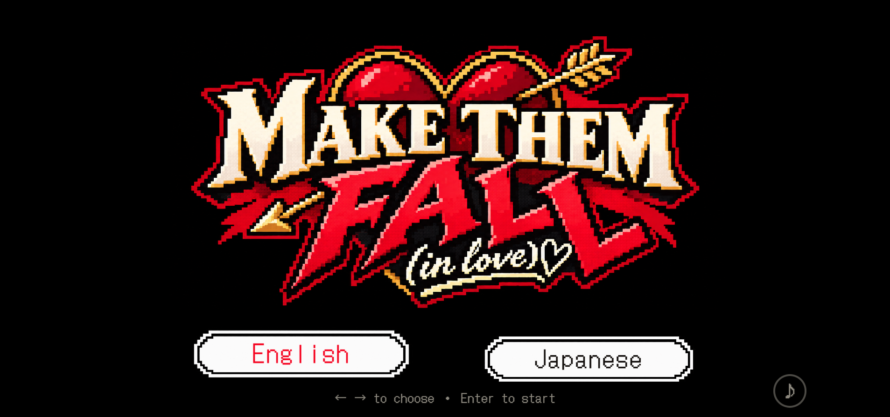

2. Start as the host, or enter a shared room code to join another player's room.

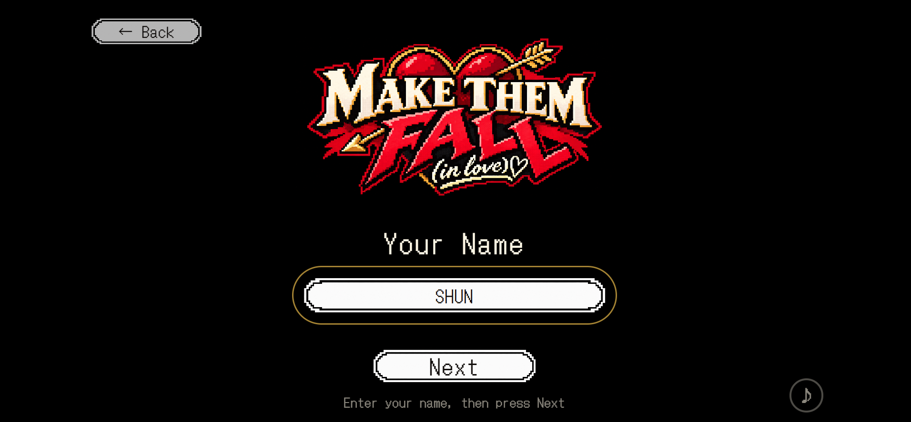

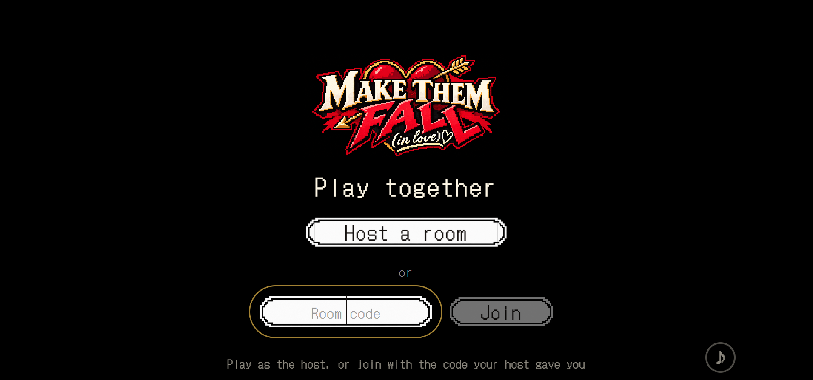

3. Watch Martin and Catherine's date begin.

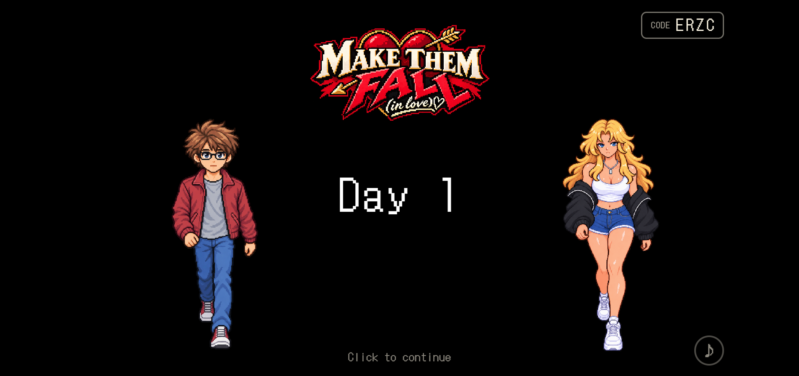

4. When the prompt phase starts, enter an idea or piece of advice for what Martin should do next. Submitted prompts appear at the top of the screen.

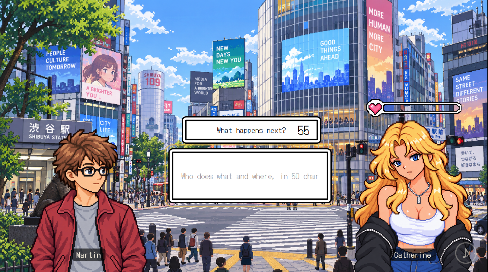

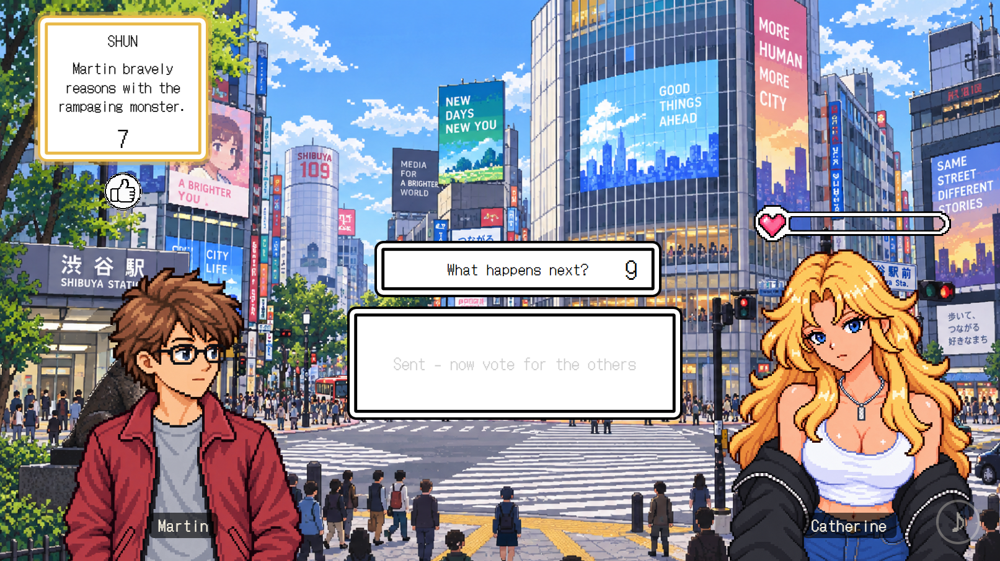

5. Like the prompts you think are best. The prompt with the most likes is selected, and AI uses it to generate the next story scene.

6. Random events may happen during the date. When an event appears, AI generates a new "What happens next?" scene for that situation.

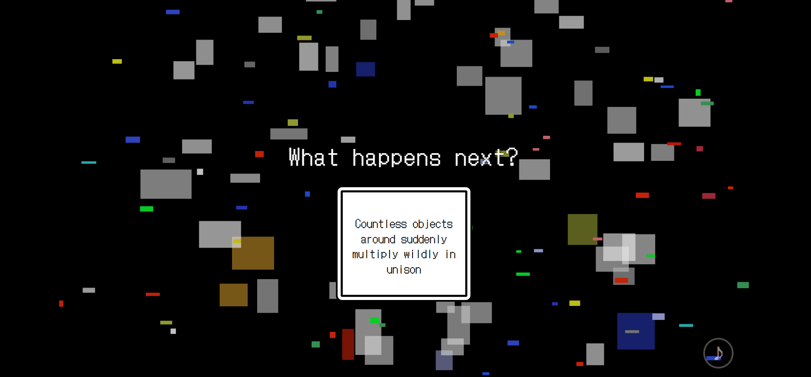

7. The event scene plays out through Martin and Catherine's dialogue.

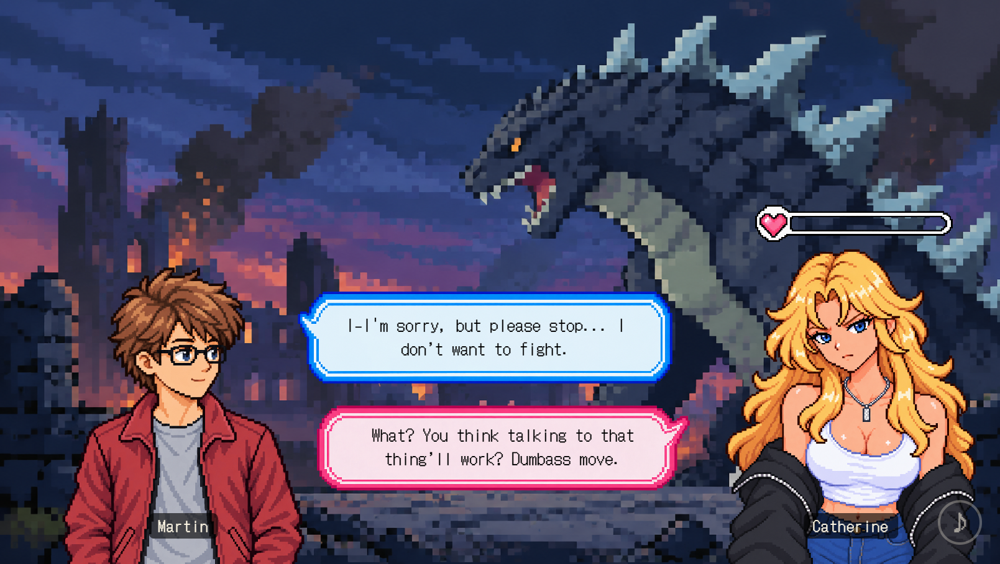

8. Catherine's affection changes depending on what happens in the story.

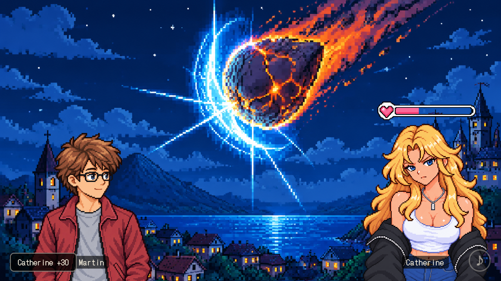

9. Your goal is to raise Catherine's affection to 100. Reaching 100 unlocks a special ending sequence, so keep playing until Martin wins Catherine's heart.

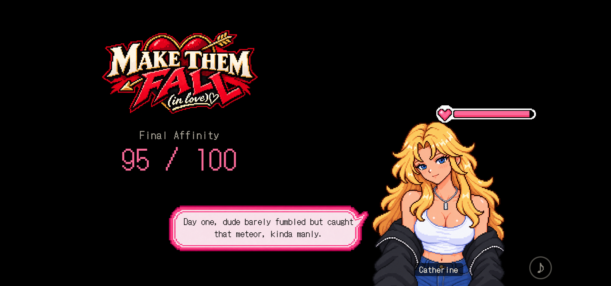

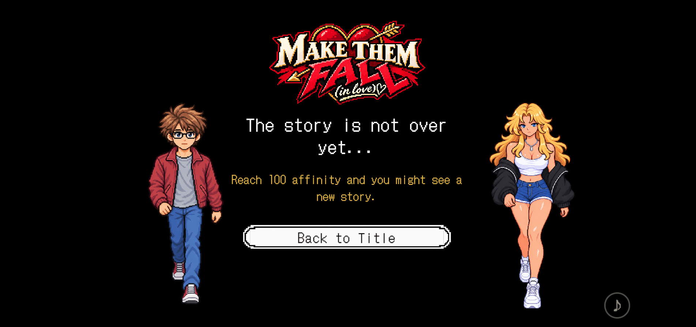

## Game Overview

What if you could step into a dating reality show and change what happens next? MAKE THEM FALL (in love) is an AI-powered multiplayer dating simulation where players influence Martin, an awkward and inexperienced guy, as he tries to win - or completely ruin - his date with Catherine.

It is designed for casual gamers, streamers, and online communities who want to shape a story together. Through Twitch, YouTube, TikTok, and other social platforms, anyone can join simply by submitting ideas or voting on what Martin should do next.

The top-voted choice becomes part of the story. AI then generates the next scene in real time - including background visuals, character reactions, dialogue, and the consequences that follow. Instead of following a fixed narrative, every playthrough evolves through the collective decisions of the audience.

Our goal is to create a Forever Game: an endlessly evolving "Unreality Show" where AI and the community continuously generate new drama, relationships, and stories.

## How It Works

- Players join a shared room and submit ideas for Martin's next move.
- The audience votes, and the top-voted idea becomes the next story prompt.
- AI generates the following scene, including dialogue, background art, relationship changes, and BGM selection.
- The story continues until Martin and Catherine either reach a happy ending or the date falls apart.

## Tech Stack

- Client: vanilla ES modules, HTML, CSS, Canvas, and WebAudio.
- Backend: Python 3.12 server via `tools/serve.py`.
- Room state: in-process memory for a single Render instance.
- Generated images: saved to disk under the server-managed asset flow.
- Deployment: `main` is configured for Render; the Vercel version lives on the `vercel` branch.

## Tools And Assets

- DotGothic16 font: SIL Open Font License 1.1.
- Blender: used for sprite and animation asset production.
- OpenMusic: used to generate BGM/audio assets.
- OpenAI: used for story, dialogue, visual generation, and AI-assisted development.
- Original project assets: character images, UI, backgrounds, sound effects, scripts, and game code were created for this project unless otherwise noted.
